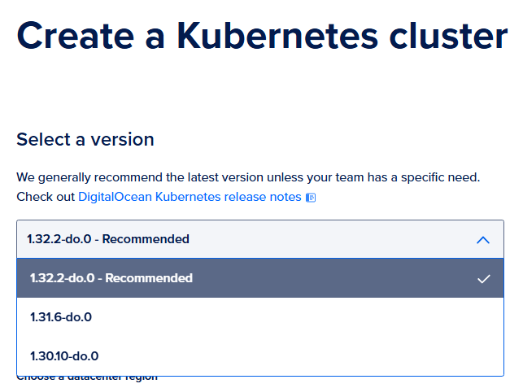

# Kubernetes Cluster on DigitalOcean with Terraform

This repository contains Terraform code to provision a Kubernetes cluster with 4 nodes on DigitalOcean.

## Prerequisites

- [Terraform installed](https://www.digitalocean.com/community/tutorials/how-to-use-terraform-with-digitalocean#step-1-installing-terraform)

- [DigitalOcean API Token](https://docs.digitalocean.com/reference/api/create-personal-access-token/)

## Setup Instructions

1. Clone the Repository

    ```bash
    git clone https://github.com/arthurkretzer/digitalocean-k8s-iac.git
    cd digitalocean-k8s-iac
    ```

2. Configure Variables

    Create a env.tfvars file and add the following content:

    ```bash
    do_token = "your_digitalocean_token"
    region   = "nyc1"
    node_size = "s-2vcpu-2gb"
    ```

3. Configure kubernetes version

    Identify kubernetes version on DigitalOcean UI and apply it to code.

    

    ```terraform
    resource "digitalocean_kubernetes_cluster" "k8s_cluster" {
        name    = "k8s-cluster"
        region  = var.region
        version = "1.32.2-do.0"
    ...
    ```

3. Use Terraform

    Create the cluster by initializing, planning and applying terraform.

    ```bash
    terraform init
    terraform plan -var-file="env.tfvars"
    terraform apply -var-file="env.tfvars"
    ```

## Outputs

- **Cluster ID**: Cluster ID for doctl commands if necessary.
- **Kubeconfig**: Kubernetes configuration file located in ./kubeconfig.yaml for cluster access. It is auto added to your kubeconfig file, or execute manually the doctl command in <https://cloud.digitalocean.com/kubernetes/clusters/your-k8s-cluster-id> getting started.
- **Cluster Endpoint**: URL to access the Kubernetes API server.

## Clean Up

To destroy the infrastructure and avoid charges:

```bash
terraform destroy -var-file=env.tfvars
```

Note: In some cases, the worker droplets might not be automatically destroyed. If this happens, manually delete them from the DigitalOcean dashboard or use the CLI:

### Install and Configure DigitalOcean CLI (doctl)

1. Install `doctl`

    Follow the documentation [here](https://docs.digitalocean.com/reference/doctl/how-to/install/).

2. Authenticate with your API token:

    ```bash
    doctl auth init
    ```

    Follow the prompt and enter your DigitalOcean API token.

3. List and delete droplets:

    ```bash
    doctl compute droplet list
    # Identify and delete the droplets
    for id in $(doctl compute droplet list --format ID --no-header); do doctl compute droplet delete $id --force; done
    ```

### Using Makefile

If you have make installed, you can use:

```bash
make clean
```

This will destroy the k8s cluster and **all** droplets in your digital ocean account.

## License

This project is licensed under the Apache License v2.0.
